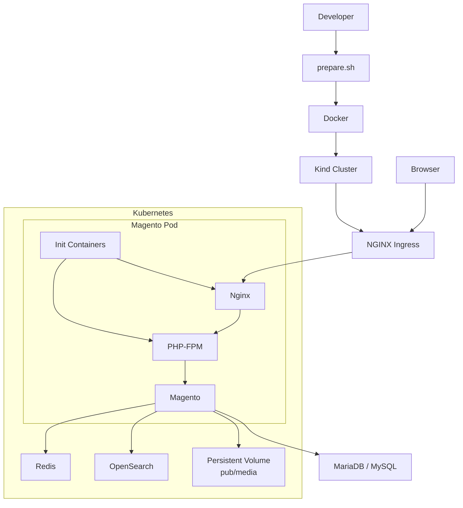
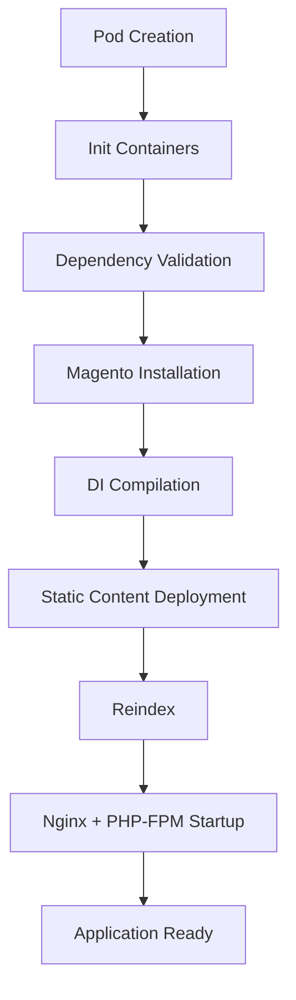

# Magento on Kubernetes

> A learning-focused project that explores how to run Magento 2.4.9 on Kubernetes using modern cloud-native technologies such as Docker, Helm, Redis, OpenSearch, Persistent Volumes, and automated deployments.

---

## ⚠️ Disclaimer

This repository is currently in **Version 1 (v1)** and was created primarily for **study, experimentation, and learning purposes**.

The goal of this project is not to provide a production-ready Magento architecture. Instead, it serves as a practical environment for understanding how Magento behaves in a containerized ecosystem and how Kubernetes concepts can be applied to a complex stateful application.

Several implementation details have been intentionally simplified to support learning objectives. Architectural decisions may change significantly as the project evolves.

Use this repository as a learning resource, reference implementation, and experimentation platform.

---

## Table of Contents

- [Project Goals](#project-goals)
- [Architecture Overview](#architecture-overview)
- [Complete Architecture Diagram](#complete-architecture-diagram)
- [Technology Stack](#technology-stack)
- [Repository Structure](#repository-structure)
- [Local Environment Setup](#local-environment-setup)
- [Deployment Workflow](#deployment-workflow)
- [Creating the Cluster](#creating-the-cluster)
- [External Infrastructure](#external-infrastructure)
- [Magento Infrastructure](#magento-infrastructure)
- [Local DNS Configuration](#local-dns-configuration)
- [Magento Deployment](#magento-deployment)
- [Monitoring and Logs](#monitoring-and-logs)
- [Troubleshooting](#troubleshooting)
- [Startup Sequence](#startup-sequence)
- [Persistence Strategy](#persistence-strategy)
- [Scaling](#scaling)
- [Current Limitations (v1)](#current-limitations-v1)
- [Roadmap](#roadmap)
- [Lessons Learned](#lessons-learned)
- [Future Vision (v2)](#future-vision-v2)
- [Conclusion](#conclusion)

---

## Project Goals

The primary objective of this project is to learn and experiment with:

- Kubernetes fundamentals
- Helm chart development
- Docker image creation
- Magento architecture
- Stateful and stateless workloads
- Persistent storage strategies
- Cloud-native deployments
- Infrastructure as Code
- Service orchestration
- Horizontal scaling concepts

This repository is intended to document the journey of running Magento in Kubernetes and understanding the trade-offs involved in modern application deployment.

---

## Architecture Overview

The platform currently consists of the following components:

| Component | Purpose |
|------------|----------|
| Magento 2.4.9 | E-commerce platform |
| Kubernetes | Container orchestration |
| Helm | Deployment management |
| Docker | Containerization |
| Kind | Local Kubernetes cluster |
| NGINX Ingress | External traffic routing |
| Nginx | Web server |
| PHP-FPM | PHP runtime |
| Redis | Cache, page cache and sessions |
| OpenSearch | Search and indexing |
| MariaDB/MySQL | Database |
| Persistent Volumes | Data persistence |
| ConfigMaps | Application configuration |
| Secrets | Sensitive configuration |

---

## Complete Architecture Diagram



---

## Repository Structure

```text
.
├── docker/
│   ├── nginx/
│   ├── php/
│   └── external-infra/
│
├── helm/
│   └── magento/
│
├── k8s/
│   ├── redis/
│   ├── opensearch/
│   ├── nfs/
│   └── namespace.yaml
│
├── kind/
│   └── cluster.yaml
│
├── prepare.sh
├── Makefile
└── README.md
```

---

## Local Environment Setup

Prepare the Linux environment:

```bash
chmod +x prepare.sh

./prepare.sh
```

The script automatically:

- Updates the operating system
- Installs Docker
- Installs kubectl
- Installs Kind
- Installs Helm
- Configures Kubernetes kernel requirements
- Configures Docker
- Validates all installations

After completion:

```bash
newgrp docker
```

Or simply log out and log in again.

---

## Deployment Workflow


---

## Creating the Cluster

Create a local Kubernetes cluster:

```bash
make create-cluster
```

This command:

- Creates a Kind cluster
- Installs NGINX Ingress Controller

Delete the cluster:

```bash
make delete-cluster
```

---

## External Infrastructure

Create supporting infrastructure:

```bash
make create-external-infra
```

Remove supporting infrastructure:

```bash
make delete-external-infra
```

---

## Magento Infrastructure

Create Kubernetes resources:

```bash
make prepare-magento-infra
```

This deploys:

- Namespace
- Redis StatefulSet
- Redis Service
- OpenSearch StatefulSet
- OpenSearch Service
- Persistent Volume
- Persistent Volume Claim

---

## Local DNS Configuration

Configure local hostname:

```bash
make insert-magento-url-hosts
```

Adds:

```text
127.0.0.1 magento.local
```

to `/etc/hosts`.

---

## Magento Deployment

Deploy Magento:

```bash
make install-magento
```

Internally executes:

```bash
helm upgrade --install magento ./helm/magento -n magento
```

Remove Magento:

```bash
make uninstall-magento
```

---

## Monitoring and Logs

Watch installation logs:

```bash
make install-magento-logs
```

List Pods:

```bash
make see-pods
```

---

## Troubleshooting

Restart Magento Pods:

```bash
make delete-magento-pods
```

Kubernetes automatically recreates deleted Pods according to the Deployment specification.

---

## Startup Sequence



The current installation process performs:

1. Pod creation
2. Init container execution
3. Dependency validation
4. Magento installation
5. Dependency injection compilation
6. Static content deployment
7. Reindexing
8. Application startup

---

## Persistence Strategy

Current persistence focuses on user-generated content.

Persisted:

```text
pub/media
```

Not persisted:

```text
generated/
pub/static/
vendor/
```

Benefits:

- Faster deployments
- Smaller persistent storage footprint
- Better support for immutable infrastructure concepts

---

## Scaling

One of the primary goals of this project was to validate Magento running in a horizontally scalable Kubernetes environment.

The current architecture already supports horizontal scaling through:

- Shared MariaDB/MySQL database
- Shared Redis services
- Shared OpenSearch service
- Persistent media storage
- Containerized Magento application
- Kubernetes Deployments
- Helm-based deployments

The environment has been successfully validated with multiple Magento replicas running simultaneously.

Current scaling capabilities:

- Multiple Magento Pods
- Pod recreation without manual intervention
- Independent infrastructure services
- Shared application data

Future improvements will focus on reducing startup times and moving more build-time operations into the Docker image to further improve scalability and deployment efficiency.

---

## Current Limitations (v1)

Current known limitations:

- Magento installation occurs during startup
- Dependency Injection compilation occurs during startup
- Static content deployment occurs during startup
- Monitoring is not implemented
- Centralized logging is not implemented
- Backup automation is not implemented
- Disaster recovery is not implemented
- High availability has not been validated

---

## Roadmap

| Feature | Status |
|----------|---------|
| Dockerized Magento | ✅ |
| Kubernetes Deployment | ✅ |
| Helm Packaging | ✅ |
| Redis Integration | ✅ |
| OpenSearch Integration | ✅ |
| Persistent Media Storage | ✅ |
| Horizontal Scaling Validation | ✅ |
| CI/CD Pipeline | 🚧 |
| Monitoring | 🚧 |
| Logging | 🚧 |
| Automated Backups | 🚧 |
| Disaster Recovery | 🚧 |
| High Availability | 🚧 |

---

## Lessons Learned

Some key observations from this project:

- Magento can successfully run in Kubernetes.
- Separating stateful and stateless workloads simplifies operations.
- Redis significantly improves Magento performance.
- OpenSearch is essential for modern Magento deployments.
- Persistent storage design is one of the biggest architectural challenges.
- Helm greatly simplifies deployment management.

---

## Future Vision (v2)

Future improvements may include:

- Fully immutable Magento images
- Precompiled dependency injection
- Pre-generated static content
- GitHub Actions CI/CD
- Prometheus monitoring
- Grafana dashboards
- Centralized logging
- Automated backups
- Horizontal Pod Autoscaler
- Multi-node validation
- Production-grade deployment patterns

---

## Conclusion

This project represents an ongoing learning journey into Magento, Kubernetes, and cloud-native infrastructure.

The architecture is intentionally evolving, and the repository serves as a practical environment for experimentation, testing, and knowledge sharing.

Contributions, suggestions, and discussions are welcome.
